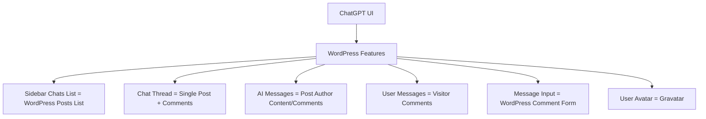

# AI Style WordPress Theme Specification

## 1. Project Overview

### 1.1 Project Description
The AI Style WordPress theme aims to recreate the look and feel of ChatGPT's user interface within WordPress. The theme maps ChatGPT's UI components to WordPress native features, creating a familiar conversational interface for content presentation.

### 1.2 Project Goals
- Create a WordPress theme that visually mimics the ChatGPT interface
- Map WordPress native features (posts, comments) to ChatGPT UI elements (chats, messages)
- Provide a familiar AI chat experience for users
- Maintain simplicity and focus on core UI elements

## 2. Target Audience

### 2.1 Primary Audience
- Businesses that want to present their content in a familiar AI chat interface
- Organizations looking to leverage the popularity and familiarity of ChatGPT's UI
- Content creators who want to present information in a conversational format

### 2.2 Use Cases
- FAQ pages presented as AI conversations
- Product information delivered through simulated chat interactions
- Customer support content organized as chat threads
- Educational content presented in a Q&A format

## 3. Design Goals

### 3.1 Visual Design
- Clean, minimal interface similar to ChatGPT
- Focus on readability and content presentation
- Clear visual distinction between AI and user messages
- Responsive design that works well on all device sizes

### 3.2 User Experience
- Intuitive navigation between different "chats" (posts)
- Seamless conversation flow within each chat
- Easy-to-use comment system for adding new messages
- Familiar interaction patterns for users who have used ChatGPT

## 4. Feature Mapping



### 4.1 ChatGPT to WordPress Mapping
| ChatGPT Feature | WordPress Implementation |
|-----------------|--------------------------|
| Sidebar with chat list | Widget area with custom posts list |
| Individual chats | WordPress posts |
| Chat messages | Post content + comments |
| AI responses | Post content and author comments |
| User messages | Visitor comments |
| Message input | WordPress comment form |
| User avatar | WordPress Gravatar |

## 5. UI Components

### 5.1 Layout Structure
```
+---------------------+-----------------------------------+
|                     |                                   |
|                     |                                   |
|                     |                                   |
|   Chat Sidebar      |        Chat Main Area            |
|   (Posts List)      |        (Post + Comments)         |
|                     |                                   |
|                     |                                   |
|                     |                                   |
|                     +-----------------------------------+
|                     |                                   |
|                     |        Message Input              |
|                     |        (Comment Form)             |
+---------------------+-----------------------------------+
```

### 5.2 Sidebar
- Contains list of all posts (chats)
- Each item shows post title
- Current post is highlighted
- Responsive design (collapsible on mobile)

### 5.3 Main Chat Area
- Displays the current post content as an AI message
- Shows all comments as a conversation thread
- Visual distinction between AI messages (post author) and user messages (commenters)
- Messages displayed in chronological order

### 5.4 Message Input
- Standard WordPress comment form styled to match ChatGPT
- Simple text input with submit button
- Positioned at the bottom of the chat area

## 6. Technical Implementation

### 6.1 Theme Structure
- Child theme based on Twenty Sixteen
- Custom templates for single posts (single.php)
- Custom styling (style.css)
- Custom functionality (functions.php)
- JavaScript for dynamic interactions (chat.js)

### 6.2 Core Files
- **style.css**: Theme metadata and styling
- **functions.php**: Custom widgets, AJAX functionality
- **single.php**: Chat interface template
- **index.php**: Inherits from parent theme

### 6.3 Key Functions
- Custom sidebar registration
- Custom widget for chat list
- AJAX functionality for loading chats
- Comment styling based on author

### 6.4 CSS Requirements
- Responsive layout
- ChatGPT-like styling for messages
- Different styling for AI vs user messages
- Mobile-friendly design

### 6.5 JavaScript Functionality
- AJAX loading of chat content
- Smooth scrolling to new messages
- Sidebar toggle for mobile

## 7. Development Roadmap

### 7.1 Phase 1: Core Implementation
- Set up child theme structure
- Implement basic layout (sidebar + main area)
- Style post content and comments as chat messages
- Create custom widget for chat list

### 7.2 Phase 2: UI Refinement
- Improve message styling to match ChatGPT
- Enhance responsive design
- Optimize comment form styling
- Add loading states and transitions

### 7.3 Phase 3: User Experience Enhancements
- Implement AJAX comment submission
- Add real-time comment updates
- Improve navigation between posts
- Optimize for performance

## 8. Future Enhancements

### 8.1 Potential Features for Later Phases
- Dark/light mode toggle
- Chat search functionality
- Conversation naming/renaming
- New chat button
- Message reactions
- Code block formatting with syntax highlighting
- Markdown support for comments

## 9. Technical Considerations

### 9.1 WordPress Compatibility
- Minimum WordPress version: 5.0+
- PHP compatibility: 7.4+
- Required plugins: None (uses core WordPress features)

### 9.2 Browser Support
- All modern browsers (Chrome, Firefox, Safari, Edge)
- Mobile browsers
- Responsive design for all screen sizes

### 9.3 Performance Considerations
- Optimize image loading
- Minimize CSS and JavaScript
- Implement lazy loading for chat history

## 10. Conclusion

The AI Style WordPress theme will provide businesses with a familiar ChatGPT-like interface for presenting their content. By mapping WordPress native features to ChatGPT UI elements, the theme creates an intuitive and engaging user experience that leverages users' familiarity with AI chat interfaces.

The initial implementation will focus on core UI elements and basic functionality, with the potential for additional features in future updates.