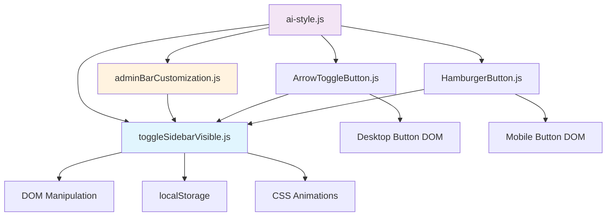

# Sidebar Toggle Refactoring Plan

## Executive Summary

This document outlines a comprehensive refactoring strategy to move all toggle-related functionality from the legacy [`adminBarCustomization.js`](src/AI_Style/ai-style.js_src/adminBarCustomization.js) file into three specialized modules: [`toggleSidebarVisible.js`](src/AI_Style/ai-style.js_src/toggleSidebarVisible.js), [`HamburgerButton.js`](src/AI_Style/ai-style.js_src/HamburgerButton.js), and [`ArrowToggleButton.js`](src/AI_Style/ai-style.js_src/ArrowToggleButton.js).

## Current State Analysis

### Current Architecture Issues

1. **Monolithic Structure**: [`adminBarCustomization.js`](src/AI_Style/ai-style.js_src/adminBarCustomization.js) contains mixed responsibilities:
   - Admin bar "New" button customization (lines 23-99)
   - Desktop sidebar toggle button creation and management (lines 105-192)
   - Mobile hamburger button integration (line 230)

2. **Code Duplication**: Toggle button state management exists in both:
   - [`adminBarCustomization.js`](src/AI_Style/ai-style.js_src/adminBarCustomization.js:176-192) - `updateToggleButton()` function
   - [`toggleSidebarVisible.js`](src/AI_Style/ai-style.js_src/toggleSidebarVisible.js:516-539) - `updateToggleButtonState()` function

3. **Incomplete Separation**: 
   - [`ArrowToggleButton.js`](src/AI_Style/ai-style.js_src/ArrowToggleButton.js) is empty
   - Desktop toggle functionality remains in [`adminBarCustomization.js`](src/AI_Style/ai-style.js_src/adminBarCustomization.js)
   - [`HamburgerButton.js`](src/AI_Style/ai-style.js_src/HamburgerButton.js) is properly separated but called from [`adminBarCustomization.js`](src/AI_Style/ai-style.js_src/adminBarCustomization.js:230)

### Current File Responsibilities

#### [`adminBarCustomization.js`](src/AI_Style/ai-style.js_src/adminBarCustomization.js) (231 lines)
- **Primary Purpose**: Admin bar "New" button customization
- **Toggle-Related Code to Extract**:
  - `addSidebarToggleButton()` (lines 105-169)
  - `updateToggleButton()` (lines 176-192)
  - Mobile hamburger integration call (line 230)

#### [`toggleSidebarVisible.js`](src/AI_Style/ai-style.js_src/toggleSidebarVisible.js) (605 lines)
- **Current Role**: Core sidebar visibility logic and state management
- **Strengths**: Well-structured with proper state management, responsive handling, and animation
- **Issues**: Contains duplicate toggle button update logic

#### [`HamburgerButton.js`](src/AI_Style/ai-style.js_src/HamburgerButton.js) (65 lines)
- **Status**: Properly implemented and separated
- **Functionality**: Mobile hamburger button creation and event handling
- **Integration**: Currently called from [`adminBarCustomization.js`](src/AI_Style/ai-style.js_src/adminBarCustomization.js:230)

#### [`ArrowToggleButton.js`](src/AI_Style/ai-style.js_src/ArrowToggleButton.js)
- **Status**: Empty file - needs implementation
- **Intended Purpose**: Desktop arrow toggle button functionality

## Refactoring Strategy

### 1. Module Responsibility Definition

#### [`toggleSidebarVisible.js`](src/AI_Style/ai-style.js_src/toggleSidebarVisible.js) - Core Engine
**Role**: Central sidebar state management and animation engine
**Responsibilities**:
- Sidebar state management and persistence
- Responsive mode detection and handling
- Animation logic (show/hide with transitions)
- Footer position coordination
- CSS injection for animations
- State persistence (localStorage)

**Public API**:
```javascript
// State Management
export function initToggleSidebar()
export function toggleSidebarVisibility()
export function isSidebarVisible()
export function getSidebarState()
export function showSidebar()
export function hideSidebar()

// Responsive Detection
export function isMobileView()
export function isDesktopView()
export function updateResponsiveMode()

// Utilities
export function getSidebarWidth()
```

#### [`ArrowToggleButton.js`](src/AI_Style/ai-style.js_src/ArrowToggleButton.js) - Desktop Interface
**Role**: Desktop-specific toggle button management
**Responsibilities**:
- Create and position desktop arrow toggle button in admin bar
- Handle desktop-specific click events
- Manage arrow icon state (left/right arrows)
- Handle desktop-specific styling and positioning
- Coordinate with [`toggleSidebarVisible.js`](src/AI_Style/ai-style.js_src/toggleSidebarVisible.js) for state changes

**Public API**:
```javascript
export function addDesktopToggleButton()
export function updateDesktopToggleButton()
export function removeDesktopToggleButton()
```

#### [`HamburgerButton.js`](src/AI_Style/ai-style.js_src/HamburgerButton.js) - Mobile Interface
**Role**: Mobile-specific toggle button management (already implemented)
**Current Responsibilities**:
- Create and position mobile hamburger button
- Handle mobile-specific click events
- Mobile-specific styling

**Public API** (existing):
```javascript
export function addMobileHamburgerIcon()
```

#### [`adminBarCustomization.js`](src/AI_Style/ai-style.js_src/adminBarCustomization.js) - Admin Bar Core
**Role**: WordPress admin bar "New" button customization only
**Responsibilities After Refactoring**:
- Override "New" button hover behavior
- Override "New" button click behavior
- Archive conversation functionality
- Coordinate toggle button initialization

### 2. Code Migration Plan

#### Phase 1: Extract Desktop Toggle Button Logic
**Source**: [`adminBarCustomization.js`](src/AI_Style/ai-style.js_src/adminBarCustomization.js:105-192)
**Destination**: [`ArrowToggleButton.js`](src/AI_Style/ai-style.js_src/ArrowToggleButton.js)

**Functions to Move**:
- `addSidebarToggleButton()` → `addDesktopToggleButton()`
- `updateToggleButton()` → `updateDesktopToggleButton()`

**Code Sections**:
```javascript
// Lines 105-169: addSidebarToggleButton function
// Lines 176-192: updateToggleButton function
```

#### Phase 2: Consolidate Toggle Button State Management
**Issue**: Duplicate state update logic exists in:
- [`adminBarCustomization.js`](src/AI_Style/ai-style.js_src/adminBarCustomization.js:176-192)
- [`toggleSidebarVisible.js`](src/AI_Style/ai-style.js_src/toggleSidebarVisible.js:516-539)

**Solution**: 
- Remove duplicate from [`adminBarCustomization.js`](src/AI_Style/ai-style.js_src/adminBarCustomization.js)
- Enhance [`toggleSidebarVisible.js`](src/AI_Style/ai-style.js_src/toggleSidebarVisible.js) to handle both desktop and mobile button updates
- Create callback system for button-specific updates

#### Phase 3: Update Integration Points
**Current Integration**: [`adminBarCustomization.js`](src/AI_Style/ai-style.js_src/adminBarCustomization.js:230) calls [`addMobileHamburgerIcon()`](src/AI_Style/ai-style.js_src/HamburgerButton.js:18)
**New Integration**: Move toggle button initialization to dedicated orchestration

### 3. Interface Definitions

#### Core State Interface
```javascript
// toggleSidebarVisible.js
interface SidebarState {
  isVisible: boolean;
  isAnimating: boolean;
  originalWidth: string;
  isMobileView: boolean;
  isDesktopView: boolean;
  resizeTimeout: number | null;
}
```

#### Button Update Callback Interface
```javascript
// toggleSidebarVisible.js
interface ButtonUpdateCallback {
  (isVisible: boolean, isMobile: boolean): void;
}

// Register callbacks for button updates
export function registerButtonUpdateCallback(callback: ButtonUpdateCallback)
```

#### Toggle Button Interface
```javascript
// ArrowToggleButton.js & HamburgerButton.js
interface ToggleButtonConfig {
  position: 'after-new-button' | 'first-item';
  iconClass: string;
  labelText: {
    open: string;
    close: string;
  };
}
```

### 4. Dependency Flow



## Implementation Order

### Step 1: Prepare [`ArrowToggleButton.js`](src/AI_Style/ai-style.js_src/ArrowToggleButton.js)
1. Implement basic module structure
2. Move `addSidebarToggleButton()` from [`adminBarCustomization.js`](src/AI_Style/ai-style.js_src/adminBarCustomization.js:105-169)
3. Rename to `addDesktopToggleButton()`
4. Update imports to use [`toggleSidebarVisible.js`](src/AI_Style/ai-style.js_src/toggleSidebarVisible.js) functions

### Step 2: Enhance [`toggleSidebarVisible.js`](src/AI_Style/ai-style.js_src/toggleSidebarVisible.js)
1. Remove duplicate `updateToggleButtonState()` function
2. Create unified button update system
3. Add callback registration for button-specific updates
4. Export button update utilities

### Step 3: Update [`adminBarCustomization.js`](src/AI_Style/ai-style.js_src/adminBarCustomization.js)
1. Remove `addSidebarToggleButton()` function (lines 105-169)
2. Remove `updateToggleButton()` function (lines 176-192)
3. Remove mobile hamburger call (line 230)
4. Update imports to remove toggle-related functions
5. Focus solely on "New" button customization

### Step 4: Update [`ai-style.js`](src/AI_Style/ai-style.js_src/ai-style.js) Integration
1. Add direct imports for [`ArrowToggleButton.js`](src/AI_Style/ai-style.js_src/ArrowToggleButton.js)
2. Update initialization sequence
3. Remove toggle-related imports from [`adminBarCustomization.js`](src/AI_Style/ai-style.js_src/adminBarCustomization.js)
4. Add proper initialization order

### Step 5: Testing and Validation
1. Verify desktop toggle functionality
2. Verify mobile toggle functionality
3. Test responsive transitions
4. Validate state persistence
5. Check integration with admin bar customization

## Risk Assessment

### High Risk Areas

1. **State Synchronization**: 
   - **Risk**: Button state and sidebar state becoming desynchronized
   - **Mitigation**: Centralized state management in [`toggleSidebarVisible.js`](src/AI_Style/ai-style.js_src/toggleSidebarVisible.js)

2. **Responsive Transitions**:
   - **Risk**: Broken behavior when switching between mobile/desktop modes
   - **Mitigation**: Comprehensive testing of resize events and mode transitions

3. **DOM Timing Issues**:
   - **Risk**: Buttons created before admin bar is ready
   - **Mitigation**: Proper initialization order and DOM ready checks

### Medium Risk Areas

1. **CSS Conflicts**: 
   - **Risk**: Animation styles conflicting between modules
   - **Mitigation**: Centralized CSS injection in [`toggleSidebarVisible.js`](src/AI_Style/ai-style.js_src/toggleSidebarVisible.js)

2. **Event Handler Conflicts**:
   - **Risk**: Multiple event handlers on same elements
   - **Mitigation**: Clear ownership boundaries and event delegation

### Low Risk Areas

1. **Import/Export Changes**: Standard refactoring with clear dependency paths
2. **Function Renaming**: Straightforward with good IDE support

## Final Architecture Specification

### Module Structure
```
src/AI_Style/ai-style.js_src/
├── adminBarCustomization.js     # WordPress admin bar "New" button only
├── toggleSidebarVisible.js      # Core sidebar state & animation engine
├── ArrowToggleButton.js         # Desktop toggle button interface
├── HamburgerButton.js           # Mobile toggle button interface
└── ai-style.js                  # Main orchestration and initialization
```

### Initialization Sequence
```javascript
// ai-style.js
document.addEventListener('DOMContentLoaded', function() {
  // 1. Initialize core sidebar functionality
  initToggleSidebar();
  
  // 2. Initialize admin bar customization (New button only)
  adminBarCustomization();
  
  // 3. Initialize toggle buttons based on responsive mode
  if (isDesktopView()) {
    addDesktopToggleButton();
  }
  if (isMobileView()) {
    addMobileHamburgerIcon();
  }
  
  // 4. Set up responsive listeners for dynamic button management
  setupResponsiveToggleButtons();
});
```

### Integration Patterns

#### State Updates
```javascript
// toggleSidebarVisible.js
function notifyButtonStateChange() {
  // Update desktop button if present
  updateDesktopToggleButton();
  
  // Mobile button doesn't need state updates (always hamburger icon)
}
```

#### Responsive Button Management
```javascript
// New function in ai-style.js or toggleSidebarVisible.js
function setupResponsiveToggleButtons() {
  window.addEventListener('resize', debounce(() => {
    const wasDesktop = isDesktopView();
    const wasMobile = isMobileView();
    
    updateResponsiveMode();
    
    if (wasDesktop !== isDesktopView()) {
      if (isDesktopView()) {
        addDesktopToggleButton();
      } else {
        removeDesktopToggleButton();
      }
    }
    
    if (wasMobile !== isMobileView()) {
      if (isMobileView()) {
        addMobileHamburgerIcon();
      } else {
        removeMobileHamburgerIcon();
      }
    }
  }, 250));
}
```

## Success Criteria

1. **Functional Requirements**:
   - [ ] Desktop toggle button works identically to current implementation
   - [ ] Mobile hamburger button works identically to current implementation
   - [ ] Responsive transitions work smoothly
   - [ ] State persistence works correctly
   - [ ] Admin bar "New" button customization remains functional

2. **Code Quality Requirements**:
   - [ ] Clear separation of concerns between modules
   - [ ] No code duplication
   - [ ] Consistent error handling
   - [ ] Proper documentation and comments
   - [ ] Clean import/export structure

3. **Performance Requirements**:
   - [ ] No performance regression
   - [ ] Efficient event handling
   - [ ] Minimal DOM manipulation
   - [ ] Proper cleanup of event listeners

## Conclusion

This refactoring will transform the current monolithic structure into a clean, modular architecture where each file has a single, well-defined responsibility. The [`toggleSidebarVisible.js`](src/AI_Style/ai-style.js_src/toggleSidebarVisible.js) module will serve as the core engine, while [`ArrowToggleButton.js`](src/AI_Style/ai-style.js_src/ArrowToggleButton.js) and [`HamburgerButton.js`](src/AI_Style/ai-style.js_src/HamburgerButton.js) will handle device-specific UI concerns. The [`adminBarCustomization.js`](src/AI_Style/ai-style.js_src/adminBarCustomization.js) will be streamlined to focus solely on its primary purpose of customizing the WordPress admin bar "New" button.