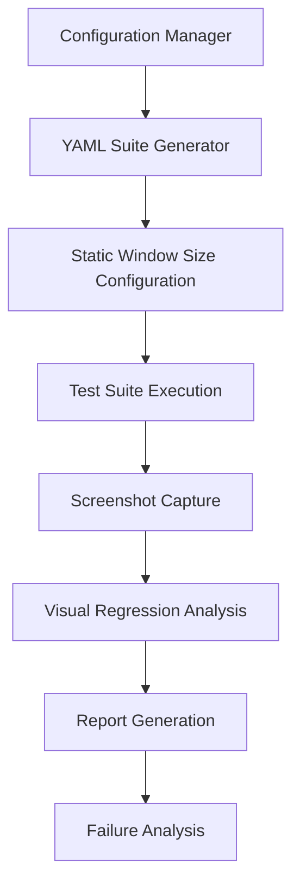

# Multi-Device, Multi-Zoom Testing Plan
## AI Style WordPress Theme Comprehensive Testing Strategy

### Overview

This document outlines a comprehensive testing strategy for the AI Style WordPress theme across various zoom levels and device screen orientations. The plan ensures consistent functionality and visual appearance across all realistic user scenarios.

### Test Matrix Summary

Following [RefactoringGuide.md](tests/RefactoringGuide.md) configuration-driven approach:

- **18 Test Cases** per configuration run
- **72 Configuration Runs** (8 device configs × 9 zoom levels)
- **Total Test Executions**: 1,296 individual test runs across all configurations
- **Static Configurations**: Each run uses fixed window size via YAML configuration
- **Focus Areas**: UI alignment, admin bar behavior, chat functionality, responsive design

---

## Current Test Coverage Analysis

### Core UI Components
- **[`MainFeaturesCept.php`](tests/acceptance/MainFeaturesCept.php)** - Tests all main UI divisions (chat container, sidebar, main area, messages, input)
- **[`CenteredItemsCept.php`](tests/acceptance/CenteredItemsCept.php)** - Tests alignment of fixed comment box with scrollable content
- **[`ChatMessagesCept.php`](tests/acceptance/ChatMessagesCept.php)** - Tests chat message functionality (add/clear interlocutor/respondent messages)

### Admin Bar Functionality
- **[`AdminBarCustomizationCept.php`](tests/acceptance/AdminBarCustomizationCept.php)** - Tests admin bar customizations
- **[`AdminBarZoomBreakpointsCept.php`](tests/acceptance/AdminBarZoomBreakpointsCept.php)** - Already tests zoom levels (100%, 175%, 200%, 250%)
- **[`AdminBarSidebarToggleIconSizeCept.php`](tests/acceptance/AdminBarSidebarToggleIconSizeCept.php)** - Tests sidebar toggle icon sizing
- **[`AdminBarCustomizationAdminAreaCept.php`](tests/acceptance/AdminBarCustomizationAdminAreaCept.php)** - Tests admin area customizations
- **[`CompareAdminBarIconsCept.php`](tests/acceptance/CompareAdminBarIconsCept.php)** - Compares admin bar icon behavior
- **[`InspectAdminBarStructureCept.php`](tests/acceptance/InspectAdminBarStructureCept.php)** - Inspects admin bar structure

### Additional Features
- **[`CommentBoxRowsCept.php`](tests/acceptance/CommentBoxRowsCept.php)** - Tests comment form functionality
- **[`PaginationCept.php`](tests/acceptance/PaginationCept.php)** - Tests pagination features
- **[`FooterCept.php`](tests/acceptance/FooterCept.php)** - Tests footer functionality
- **[`FooterBugCept.php`](tests/acceptance/FooterBugCept.php)** - Tests footer bug fixes
- **[`ScrollbarPositionCept.php`](tests/acceptance/ScrollbarPositionCept.php)** - Tests scrollbar positioning
- **[`ScrollbarVisableCept.php`](tests/acceptance/ScrollbarVisableCept.php)** - Tests scrollbar visibility
- **[`StartupFocusPositionCept.php`](tests/acceptance/StartupFocusPositionCept.php)** - Tests initial focus positioning
- **[`StopNewPostCreationCept.php`](tests/acceptance/StopNewPostCreationCept.php)** - Tests post creation prevention
- **[`ScreenCaptureCept.php`](tests/acceptance/ScreenCaptureCept.php)** - Captures UI screenshots

---

## Device Configuration Matrix

### Mobile Portrait
- **iPhone 8**: 375px × 667px
- **iPhone 11**: 414px × 896px
- **Android Standard**: 360px × 640px

### Mobile Landscape
- **iPhone 8**: 667px × 375px
- **iPhone 11**: 896px × 414px
- **Android Standard**: 640px × 360px

### Tablet Portrait
- **iPad**: 768px × 1024px
- **Android Tablet**: 800px × 1280px

### Tablet Landscape
- **iPad**: 1024px × 768px
- **Android Tablet**: 1280px × 800px

### Desktop Standard
- **Full HD**: 1920px × 1080px
- **Common Laptop**: 1366px × 768px
- **MacBook**: 1440px × 900px

---

## Test Execution Framework

### Framework Architecture



### Configuration-Driven Execution Approach

Following the [RefactoringGuide.md](tests/RefactoringGuide.md) principles:

- **Static Configuration**: Each test suite run uses one fixed window size configuration
- **YAML-Based Setup**: Window sizes are configured in [`acceptance.suite.yml`](tests/acceptance.suite.yml) via WebDriver `window_size` parameter
- **No Dynamic Resizing**: Tests do NOT change window size during execution
- **Configuration-Aware Logic**: Tests query current configuration to determine appropriate behavior

#### Execution Matrix Strategy

Instead of dynamic combinations, we execute:
- **18 Test Cases** per configuration run
- **72 Total Configuration Runs** (8 device configs × 9 zoom levels)
- **Separate Suite Execution** for each device/zoom combination

---

## Test Data Management Strategy

### Standardized Test Data
- **Consistent lorem ipsum messages** for chat functionality
- **Predefined user authentication state** via [`AcceptanceConfig::BASE_URL`](tests/_support/AcceptanceConfig.php:15)
- **Standardized post content** for [`AcceptanceConfig::TEST_POST_PAGE`](tests/_support/AcceptanceConfig.php:18)
- **Controlled sidebar state** and admin bar configuration
- **Configuration-Aware Test Logic**: Tests retrieve current window size and device mode from configuration

```

### Screenshot Organization Structure

```
tests/_output/
├── screenshots/
│   ├── baseline/           # Reference screenshots at 100% zoom, desktop
│   ├── configurations/     # New: organized by YAML configuration runs
│   │   ├── desktop_1920x1080_100/
│   │   ├── desktop_1920x1080_150/
│   │   ├── desktop_1920x1080_200/
│   │   ├── tablet_portrait_768x1024_100/
│   │   ├── tablet_portrait_768x1024_150/
│   │   ├── tablet_landscape_1024x768_100/
│   │   ├── mobile_portrait_375x667_100/
│   │   ├── mobile_portrait_375x667_150/
│   │   ├── mobile_landscape_667x375_100/
│   │   └── [additional_configurations]/
│   └── failures/           # Screenshots when tests fail
```

### YAML Configuration Examples

Based on [RefactoringGuide.md](tests/RefactoringGuide.md) specifications:

#### Desktop Configuration (1920×1080, 100% zoom)
```yaml
# acceptance.suite.yml
modules:
  enabled:
    - WebDriver:
        window_size: 1920x1080
        device_mode: desktop
```

#### Mobile Portrait Configuration (375×667, 100% zoom)
```yaml
# acceptance.suite.yml
modules:
  enabled:
    - WebDriver:
        window_size: 375x667
        device_mode: mobile_portrait
```

#### Tablet Landscape Configuration (1024×768, 100% zoom)
```yaml
# acceptance.suite.yml
modules:
  enabled:
    - WebDriver:
        window_size: 1024x768
        device_mode: tablet_landscape
```

---


### Key Visual Checkpoints

1. **Admin Bar Responsiveness**
   - Icons/labels visibility at different zoom levels
   - Breakpoint behavior at 175%, 200%, 250% (as tested in [`AdminBarZoomBreakpointsCept.php`](tests/acceptance/AdminBarZoomBreakpointsCept.php))

2. **Chat Container Layout**
   - Message alignment and scrolling behavior
   - Interlocutor vs respondent message positioning

3. **Fixed Comment Box**
   - Positioning relative to chat messages (as tested in [`CenteredItemsCept.php`](tests/acceptance/CenteredItemsCept.php))
   - Alignment tolerance: ≤10px difference

4. **Sidebar Functionality**
   - Toggle behavior and content visibility
   - Responsive collapse/expand behavior

5. **Footer Positioning**
   - Proper placement across all configurations
   - No overlap with main content

---
