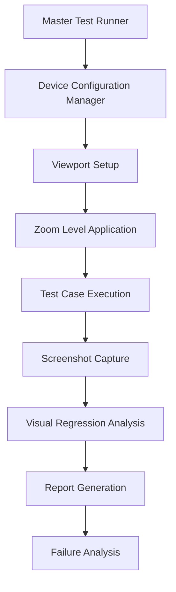

# Multi-Device, Multi-Zoom Testing Plan
## AI Style WordPress Theme Comprehensive Testing Strategy

### Overview

This document outlines a comprehensive testing strategy for the AI Style WordPress theme across various zoom levels and device screen orientations. The plan ensures consistent functionality and visual appearance across all realistic user scenarios.

### Test Matrix Summary

- **18 Existing Test Cases** × **9 Zoom Levels** × **8 Device Configurations**
- **Total Test Executions**: 1,296 combinations
- **Focus Areas**: UI alignment, admin bar behavior, chat functionality, responsive design

---

## Current Test Coverage Analysis

### Core UI Components
- **[`MainFeaturesCept.php`](tests/acceptance/MainFeaturesCept.php)** - Tests all main UI divisions (chat container, sidebar, main area, messages, input)
- **[`CenteredItemsCept.php`](tests/acceptance/CenteredItemsCept.php)** - Tests alignment of fixed comment box with scrollable content
- **[`ChatMessagesCept.php`](tests/acceptance/ChatMessagesCept.php)** - Tests chat message functionality (add/clear interlocutor/respondent messages)

### Admin Bar Functionality
- **[`AdminBarCustomizationCept.php`](tests/acceptance/AdminBarCustomizationCept.php)** - Tests admin bar customizations
- **[`AdminBarZoomBreakpointsCept.php`](tests/acceptance/AdminBarZoomBreakpointsCept.php)** - Already tests zoom levels (100%, 175%, 200%, 250%)
- **[`AdminBarSidebarToggleIconSizeCept.php`](tests/acceptance/AdminBarSidebarToggleIconSizeCept.php)** - Tests sidebar toggle icon sizing
- **[`AdminBarCustomizationAdminAreaCept.php`](tests/acceptance/AdminBarCustomizationAdminAreaCept.php)** - Tests admin area customizations
- **[`CompareAdminBarIconsCept.php`](tests/acceptance/CompareAdminBarIconsCept.php)** - Compares admin bar icon behavior
- **[`InspectAdminBarStructureCept.php`](tests/acceptance/InspectAdminBarStructureCept.php)** - Inspects admin bar structure

### Additional Features
- **[`CommentBoxRowsCept.php`](tests/acceptance/CommentBoxRowsCept.php)** - Tests comment form functionality
- **[`PaginationCept.php`](tests/acceptance/PaginationCept.php)** - Tests pagination features
- **[`FooterCept.php`](tests/acceptance/FooterCept.php)** - Tests footer functionality
- **[`FooterBugCept.php`](tests/acceptance/FooterBugCept.php)** - Tests footer bug fixes
- **[`ScrollbarPositionCept.php`](tests/acceptance/ScrollbarPositionCept.php)** - Tests scrollbar positioning
- **[`ScrollbarVisableCept.php`](tests/acceptance/ScrollbarVisableCept.php)** - Tests scrollbar visibility
- **[`StartupFocusPositionCept.php`](tests/acceptance/StartupFocusPositionCept.php)** - Tests initial focus positioning
- **[`StopNewPostCreationCept.php`](tests/acceptance/StopNewPostCreationCept.php)** - Tests post creation prevention
- **[`ScreenCaptureCept.php`](tests/acceptance/ScreenCaptureCept.php)** - Captures UI screenshots

---

## Device Configuration Matrix

### Mobile Portrait
- **iPhone 8**: 375px × 667px
- **iPhone 11**: 414px × 896px
- **Android Standard**: 360px × 640px

### Mobile Landscape
- **iPhone 8**: 667px × 375px
- **iPhone 11**: 896px × 414px
- **Android Standard**: 640px × 360px

### Tablet Portrait
- **iPad**: 768px × 1024px
- **Android Tablet**: 800px × 1280px

### Tablet Landscape
- **iPad**: 1024px × 768px
- **Android Tablet**: 1280px × 800px

### Desktop Standard
- **Full HD**: 1920px × 1080px
- **Common Laptop**: 1366px × 768px
- **MacBook**: 1440px × 900px

---

## Zoom Level Test Matrix

Based on existing zoom level screenshots in [`tests/_data/screenshots/zoom_levels/`](tests/_data/screenshots/zoom_levels/):

- **25%** - Extreme zoom out
- **50%** - High zoom out
- **75%** - Moderate zoom out
- **100%** - Standard zoom (baseline)
- **150%** - Moderate zoom in
- **200%** - High zoom in (WordPress admin bar breakpoint)
- **250%** - Very high zoom in
- **300%** - Extreme zoom in
- **400%** - Maximum zoom in

---

## Test Execution Framework

### Framework Architecture



### Matrix Execution Approach

Each test case is executed across all combinations of:
- **18 Test Cases** (current acceptance tests)
- **9 Zoom Levels** (25% to 400%)
- **8 Device Configurations** (mobile/tablet/desktop in various orientations)

---

## Test Data Management Strategy

### Standardized Test Data
- **Consistent lorem ipsum messages** for chat functionality
- **Predefined user authentication state** via [`AcceptanceConfig::BASE_URL`](tests/_support/AcceptanceConfig.php:15)
- **Standardized post content** for [`AcceptanceConfig::TEST_POST_PAGE`](tests/_support/AcceptanceConfig.php:18)
- **Controlled sidebar state** and admin bar configuration

### Screenshot Organization Structure

```
tests/_output/
├── screenshots/
│   ├── baseline/           # Reference screenshots at 100% zoom, desktop
│   ├── zoom_levels/        # Current zoom screenshots (already exists)
│   ├── device_matrix/      # New: organized by device/zoom combinations
│   │   ├── mobile_portrait/
│   │   │   ├── 25_percent/
│   │   │   ├── 50_percent/
│   │   │   ├── 75_percent/
│   │   │   ├── 100_percent/
│   │   │   ├── 150_percent/
│   │   │   ├── 200_percent/
│   │   │   ├── 250_percent/
│   │   │   ├── 300_percent/
│   │   │   └── 400_percent/
│   │   ├── mobile_landscape/
│   │   ├── tablet_portrait/
│   │   ├── tablet_landscape/
│   │   └── desktop_standard/
│   └── failures/           # Screenshots when tests fail
```

---

## Visual Regression Testing Approach

### Screenshot Comparison Strategy
- **Baseline Images**: Desktop 1920×1080 at 100% zoom for each test case
- **Comparison Tolerance**: 5% pixel difference threshold for layout variations
- **Critical Elements**: Focus on UI alignment, text readability, button accessibility
- **Automated Comparison**: Use image diff tools to highlight layout breaks

### Key Visual Checkpoints

1. **Admin Bar Responsiveness**
   - Icons/labels visibility at different zoom levels
   - Breakpoint behavior at 175%, 200%, 250% (as tested in [`AdminBarZoomBreakpointsCept.php`](tests/acceptance/AdminBarZoomBreakpointsCept.php))

2. **Chat Container Layout**
   - Message alignment and scrolling behavior
   - Interlocutor vs respondent message positioning

3. **Fixed Comment Box**
   - Positioning relative to chat messages (as tested in [`CenteredItemsCept.php`](tests/acceptance/CenteredItemsCept.php))
   - Alignment tolerance: ≤10px difference

4. **Sidebar Functionality**
   - Toggle behavior and content visibility
   - Responsive collapse/expand behavior

5. **Footer Positioning**
   - Proper placement across all configurations
   - No overlap with main content

---

## Test Automation Scripts

### Batch Execution Scripts

1. **Master Test Runner** (`run_matrix_tests.php`)
   - Iterates through all device/zoom combinations
   - Executes each test case with proper viewport and zoom settings
   - Manages screenshot capture and organization
   - Handles test failures and retries

2. **Device Configuration Manager** (`DeviceConfig.php`)
   - Defines viewport dimensions for each device type
   - Manages zoom level application via JavaScript
   - Handles orientation switching and viewport resizing

3. **Screenshot Manager** (`ScreenshotManager.php`)
   - Organizes screenshots into the matrix folder structure
   - Generates comparison reports between baseline and test images
   - Creates visual diff images highlighting changes

### Execution Commands

```bash
# Run full matrix (all tests, all devices, all zoom levels)
bin/codecept run acceptance --env matrix_full

# Run specific device category
bin/codecept run acceptance --env mobile_only
bin/codecept run acceptance --env tablet_only
bin/codecept run acceptance --env desktop_only

# Run specific zoom range
bin/codecept run acceptance --env zoom_low    # 25%-100%
bin/codecept run acceptance --env zoom_high   # 150%-400%

# Run critical path tests (mobile portrait + desktop at all zoom levels)
bin/codecept run acceptance --env critical_path

# Run admin bar specific tests across all configurations
bin/codecept run acceptance --env admin_bar_matrix
```

---

## Test Reporting Structure

### HTML Report Generation
- **Matrix view** showing pass/fail status for each device/zoom combination
- **Interactive screenshot galleries** for visual comparison
- **Failure analysis** with before/after screenshots

### Report Categories

1. **Critical Failures**
   - Broken functionality or major layout issues
   - UI elements completely missing or non-functional

2. **Visual Inconsistencies**
   - Minor alignment or styling differences
   - Acceptable responsive design variations

3. **Device-Specific Problems**
   - Issues only occurring on certain configurations
   - Orientation-specific layout problems

---

## Test Failure Criteria

### Critical Failures (Test Must Fail)
- **UI elements not visible** or completely misaligned (>50px offset)
- **JavaScript functionality broken** (chat messages not working)
- **Admin bar icons/labels** not following WordPress core behavior
- **Fixed comment box** not aligned with chat messages (>10px tolerance from [`CenteredItemsCept.php`](tests/acceptance/CenteredItemsCept.php))

### Warning Level Issues (Log but Continue)
- **Minor visual inconsistencies** (<10px alignment differences)
- **Screenshot comparison differences** within 5-15% threshold

### Device-Specific Tolerances
- **Mobile**: Higher tolerance for text wrapping and layout adjustments
- **Tablet**: Medium tolerance for responsive design variations
- **Desktop**: Strict tolerance for pixel-perfect alignment

---

## Test Execution Strategy

### Phase 1: Baseline Establishment
- Run all 18 tests at 100% zoom on desktop (1920×1080)
- Capture reference screenshots for visual regression

### Phase 2: Critical Path Testing
- **Mobile portrait** + **Desktop standard** at all zoom levels
- Focus on admin bar breakpoints (175%, 200%, 250%)
- Validate core functionality across primary use cases

### Phase 3: Full Matrix Execution
- All device/zoom combinations (1,296 total executions)
- Automated screenshot comparison and reporting
- Parallel execution where possible to reduce total runtime

### Phase 4: Analysis and Optimization
- Review failure patterns and common issues
- Adjust tolerance thresholds based on results
- Update baseline images as needed
- Optimize test execution for future runs

---

## Quality Assurance Metrics

### Success Criteria
- **>95% pass rate** for critical functionality tests
- **>90% pass rate** for visual consistency tests

### Key Performance Indicators
- **Test Coverage**: All 18 test cases across all configurations
- **Visual Regression Detection**: Automated identification of layout changes
- **Failure Analysis**: Root cause identification and resolution tracking

---

## Maintenance and Update Procedures

### Regular Maintenance Tasks

1. **Baseline Screenshot Updates**
   - Regenerate baseline screenshots when theme updates are made
   - Version control baseline images with theme releases
   - Document visual changes in release notes

2. **Test Suite Maintenance**
   - Review and update device configurations as new devices emerge
   - Adjust zoom level ranges based on user analytics
   - Update tolerance thresholds based on failure analysis

3. **Test Suite Optimization**
   - Monitor screenshot storage usage and implement cleanup policies
   - Review test matrix efficiency and remove redundant combinations

### Update Triggers
- **Theme CSS/JavaScript changes** affecting layout or functionality
- **WordPress core updates** affecting admin bar behavior
- **New device/browser support requirements**
- **User-reported visual issues** at specific zoom levels

### Documentation Requirements
- **Test execution logs** with timestamps and results
- **Visual regression reports** with before/after comparisons
- **Device compatibility matrix** showing supported configurations
- **Troubleshooting guide** for common test failures

---

## Implementation Checklist

- [ ] Create device configuration management system
- [ ] Implement zoom level application framework
- [ ] Set up screenshot organization structure
- [ ] Develop visual regression comparison tools
- [ ] Create batch execution scripts
- [ ] Implement HTML report generation
- [ ] Set up automated failure analysis
- [ ] Create maintenance procedures documentation
- [ ] Establish baseline screenshot library
- [ ] Configure parallel test execution
- [ ] Set up continuous integration integration
- [ ] Create troubleshooting documentation

---

## Conclusion

This comprehensive testing plan ensures the AI Style WordPress theme maintains consistent functionality and visual appearance across all realistic user scenarios. The matrix approach provides thorough coverage while the phased execution strategy allows for efficient testing and quick identification of critical issues.

The plan balances comprehensive coverage with practical execution, focusing on the most important user scenarios while providing the flexibility to expand testing as needed.